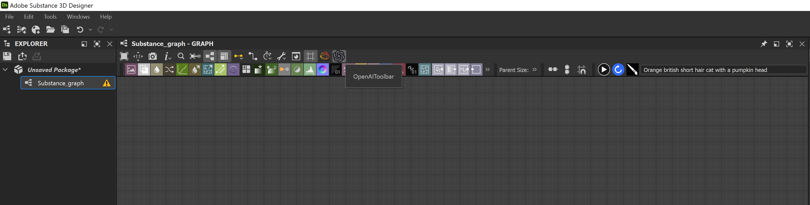

# OpenAI - Substance Designer Plugin

## Description

This project contains plugin to use OpenAI DALL-E2 inside Substance Designer.

Users can create images from text prompts, get variations for any node in substance designer or modify existing images using a mask.

## Requirements

- Substance Designer 10.1.1 or above
- OpenAI DALL-E2 API Key

## Installation

1) Download the assignment-final folder from this repo.
2) Open Substance Designer.
3) Open Plugin Manager from Tools > Plugin Manager.
4) Click on Install Button and select the *image_creator.sdplugin*.

    

5) Create a free or paid account for [OpenAI](https://openai.com/) in order to get the API Key.
6) Login to the newly created account. Click on Presonal (on the top right), then click on View API Keys.

    

7) Click on *Create New Secret Key* button

    

    **Note:** Do not share the API Key with anyone.

8) Copy the key.
9) Navigate to the folder below.

        Documents\Adobe\Adobe Substance 3D Designer\python\sduserplugins\image_creator\image_creator\
10) Open **.keys.txt** file in notepad or any other text editor.
11) Delete everything in **.keys.txt**, paste your **API key** and save the text document.
12) Restart Substance Designer.

Plugin is now installed and should be ready to use.

## Using the Plugin

1) If the plugin was successfully installed you should see the OpenAI toolbar on creating a new graph in Substance Designer. You can click on the OpenAI icon to hide or unhide the plugin related UI.

   

2) Write any text prompt in the text field and press play button to create a bitmap node with the resultant image.

3) Select any node with RGBA output in the active graph and then click on the blue refresh button to create variations.

   **Note:** If you are using the free version of OpenAI then the selected node image should be less than 4MB, reduce the Project resolution to decrease the output image size. Errors regarding this can be seen in Windows > Console.

4) Select a RGBA Image and a back and white RGBA mask with a new prompt and then click on the button with the "paint brush icon" to edit the image only in the masked areas with the new text prompt.
